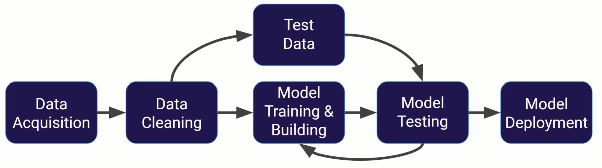
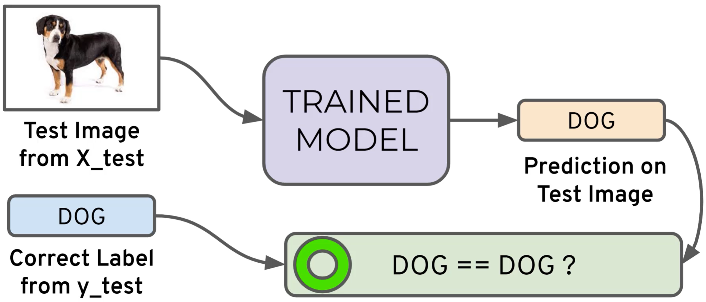
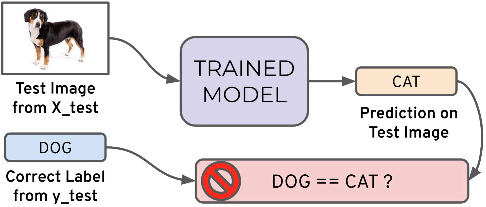
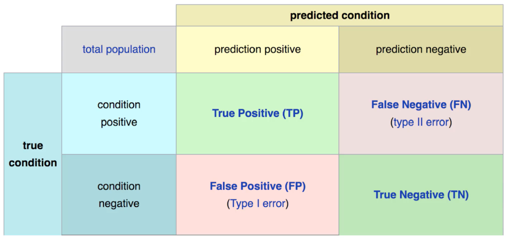
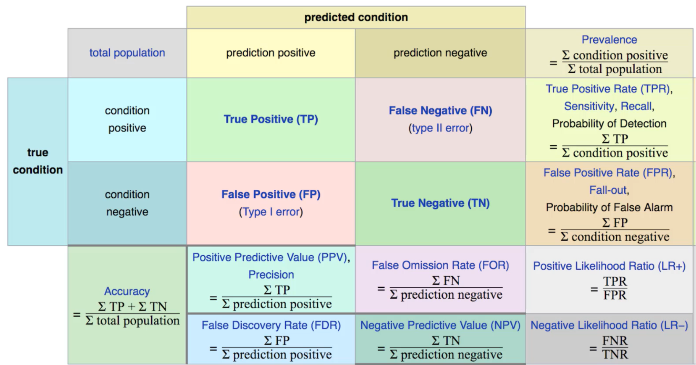
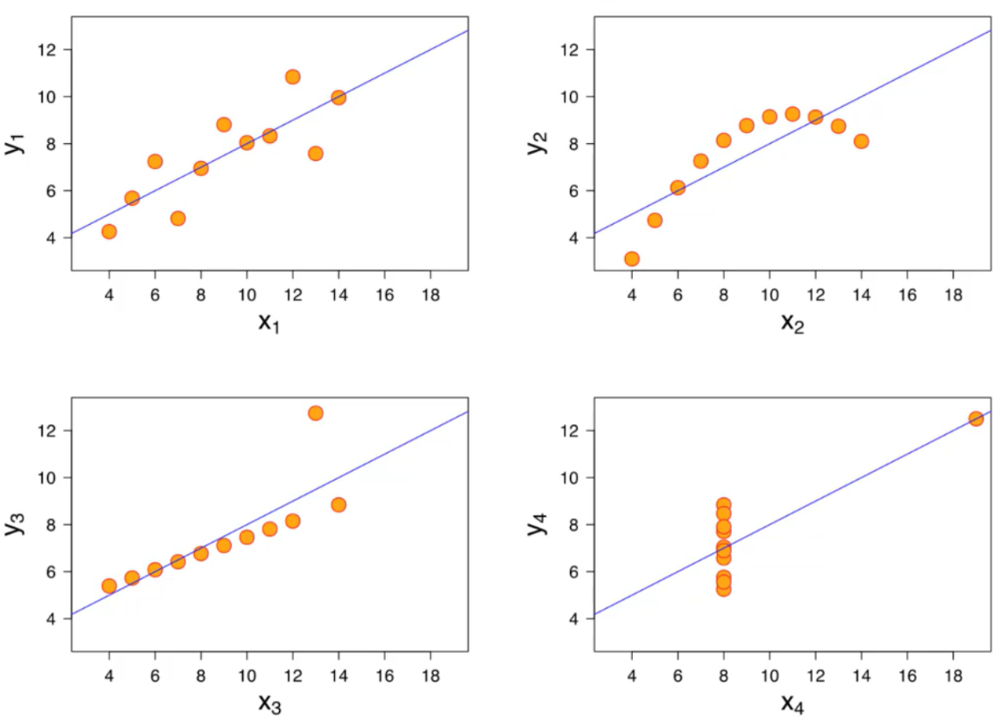
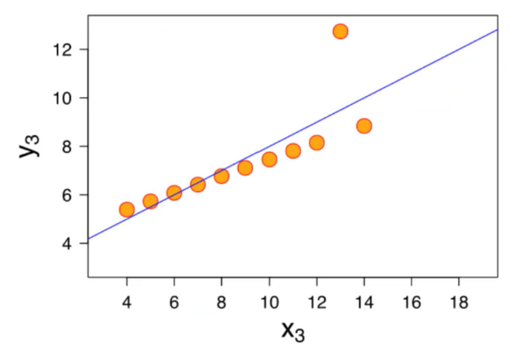
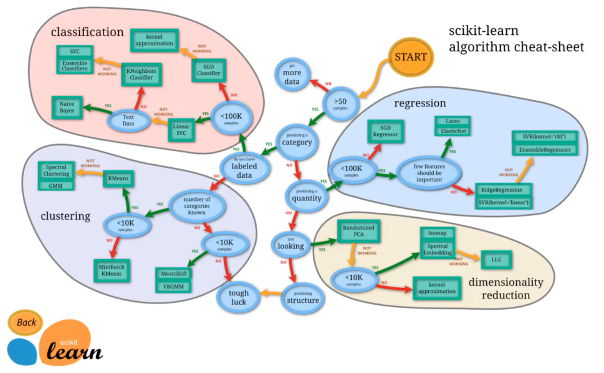

```{r setup, include=FALSE}
knitr::opts_chunk$set(echo = TRUE)

pagebreak <- function() {
  if(knitr::is_latex_output())
    return("\\newpage")
  else
    return('<div style="page-break-before: always;" />')
}

Sys.setenv(RETICULATE_PYTHON = "C:/Users/phili/AppData/Local/Programs/Python/Python38")
library(reticulate)
use_python("C:/Users/phili/AppData/Local/Programs/Python/Python38")
```

`r pagebreak()`

## 1. Supervised Learning

**Supervised learning** algorithms are trained using **labeled** examples, such as an input where the desired output is known.
For example, a segment of text could have a category label, such as:

- **Spam** vs. **Legitimate** Email
- **Positive** vs. **Negative** Movie Review

The network receives a set of inputs along with the corresponding correct outputs, and the algorithm learns by comparing its actual output with correct outputs to find errors.
It then modifies the model accordingly.

Supervised learning is commonly used in applications where historical data predicts likely future events.

### 1.1 Machine Learning Process

```{r, echo=FALSE, fig.cap="Machine Learning Process", out.width="60%", fig.align='center'}

```

#### 1.1.1. Data Acquisition

- Get your data! Customers, Sensors, etc...
- Data have to acquired.

#### 1.1.2. Data Cleaning

- Clean and format your data (using pandas)

#### 1.1.3. Training Data & Test Data

- We split the Data in Training and Test Data
- For example: 30% Test Data, 70% Training Data

#### 1.1.4. Model Training & Building

- Use Traning Data for our Network/Model in order to fit a Model with the Data.

#### 1.1.5. Test Data -> Model Testing

- How well is our Model? Run the Test Data through the Model.
- Get the Prediction of the Model.
- Compare to the right answer.
- Evaluate -> Adjust Model Parameters.

#### 1.1.6. Model Deploy

- If everything is good, then we can deploy the Model.

What we just showed is a simplified approach to supervised learning, it contains an issue! Is it fair to use our single split of the data to evaluate our models performance? After all, we were given the change to update the model parameters again and again.

To fix the issue, data is often split into **3 sets**

- Training Data
  - Used to train model Parameters
- Validation Data
  - Used to determine what model hyperparameters to adjust
- Test Data
  - Used to get some final performance metrix

Fit Model with the **Training Data**. Check the performance on the **Validation Data**, maybe go back and adjust the Model. Repeat the process until your satisfied with the performance. Now evaluate the true performance with the **Test Data**. The model never have seen that Data. You don't go back to adjust the Parameters.

This finale measure is what we label the true performance of the model to be.

## 2. Evaluating Performance

### 2.1. Classification Error Metrics

#### 2.1.1. Model Evaluation

- We just learned that after our machine learning process is complete, we will use performance metrics to evaluate how our model did.
- Let's discuss classification metrics in more detail!
- The key classification metrics we need to understand are:
  - Accuracy
  - Recall
  - Precision
  - F1-Score

Typically in any classification (categorical values) task your model can only achieve two result:

- Either your mod#el was **correct** in its prediction.
- Or your model was **incorrect** in its prediction.

Fortunately incorrect vs correct expands to situations where you have multiple classes. For the purpose of explaining the metrics, let's imagine a **binary classification** situation, where we only have two available classes.

In our example, we will attempt to predict if an image is a dog or a cat. Since this is supervised learning, we will first **fit/train** a model on **training data**. Once we have the model's predictions from the **X_test** data, we compare it to the **true y values** (the correct labels).

```{r, echo=FALSE, fig.cap="Dog to Dog", out.width="60%", fig.align='center'}

```

```{r, echo=FALSE, fig.cap="Dog to Cat", out.width="60%", fig.align='center'}

```

We repeat this process for all the images in our **X** test data.
At the end we will have a count of correct matches and a count of incorrect matches. The Key realization we need to make, is that **in the real world, not all incorrect or correct matches hold equal value!**.

Also in the real world, a single metric won't tell the complete story! To understand all of this, let's bring back the 4 metrics we mentioned and see how they are caluclated. We could organize our predicted values compare to the real values in a **confusion matrix**.

##### 2.1.1.1. Accuracy

Accuracy in classification problems is the **number of correct predictions** made by the model divided by the **total number of predictions**
For example, if the X_test set was 100 images and our model **correctly** predicted 80 images, the we have **80/100** -> **0.8** or **80% accuracy**.

Accuracy is useful when target classes are well balanced.
In our example, we would have roughly the same amount of cat images as we have dog images.

Accuracy is **not** a good choice with **unbalanced** classes!

- Imagine we had 99 images of dogs and 1 image of cat.
- If our model was simply a line that always predicted **dog** we would get 99% accuracy!

In this situation we'll want to understand **recall** and **precision**.

##### 2.1.1.2. Recall

Ability of a model to find all the relevant cases within a dataset.
The precise definition of recall is the number of true positives **divided by** the number of true positives plus the number of false negatives.

##### 2.1.1.3. Precision

Ability of a classification model to identidy only the relevant data points.
Precision is defined as the number of true positives divided by the number of true positives plus the number of false positives.

##### 2.1.1.4. Recall vs. Precision

Often you have a trade-off between Recall and Precision. While recall expresses the ability to find all relevant instances in a dataset, precision expresses the proportion of the data points our model says was relevant actually were relevant.

##### 2.1.1.5. F1-Score

In cases where we want to find an optimal blend of precision and recall we can combine the two metrics using what is called the F1 Score.

The F1 score is the **harmonic mean** of precision and recall taking both metrics into account in the following equiation:

$$
F_{1}=2*\frac{\mathrm{precision}*\mathrm{recall}}{\mathrm{precision}+\mathrm{recall}}
$$

We use the harmonic mean instead of a simple average because it punishes extreme values. A classifier with a precision of 1.0 and a recall of 0.0 has a simple average of 0.5, but an F1-Score of 0.

#### 2.1.2. Confusion Matrix

We can also view all correctly classified versus incorrectly classified images in the form of a confusion matrix.

```{r, echo=FALSE, fig.cap="Confusion Matrix", out.width="60%", fig.align='center'}

```

- True Positive: Someone having a disease and the model predicts it correctly.
- True Negative: Someone isn't having the disease and the model predicts negative.

There are two types or Erros:

- False Positive (Type I Error): Person doens't have a disease, but you predict positive.
- False Negative (Type II Error): Person does have a disease, but you predicts negative.

```{r, echo=FALSE, fig.cap="Confusion Matrix Formula", out.width="60%", fig.align='center'}

```

The main point to remember with the confusion matrix and the various calculated metrics is that they are all fundamentally ways of comparing the predicted values versus the true values. What constitutes "good" metrics, will really depend on the specific situation!

<https://en.wikipedia.org/wiki/Confusion_matrix>

Think back on the idea of:

- What is a good enough accuracy?

This depends on the context of the situation. Did you create a model to predict presence of a disease? Is this disease presence well balanced in the general populatoin? Probably not. Then we would have an unbalanced class (bad for accuracy).

Often models are used as quick diagnostic tests to have **before** having a more invasive test (e.g. getting urine test before getting a biopsy). We also need to consider what is at stake!

Often we have a precision/recall trade off. We need to decide if the model will should focus on fixing False Positives vs. False Negatives. In disease diagnostics, it is probably better to go in the direction of False Positives, so we make sure we correctly classify as many cases of disease as possible!

All of this is to day, machine learning is not performed in a "vacuum", but instead a collaborative process where we shoul consult with experts in the domain (e.g. medical doctors).

### 2.2. Regression

#### 2.2.1. Evaluating Regression

Let's take a moment now to discuss evaluating Regression Models. Regression is a task when a model attempts to predict continuous values (unlike categorical values, which is classification).

Metrics like accuracy or recall aren't useful for regression problems, we need metrics designed for **continuous** values!

Example:

- Regression Taks: Attempting to predict the price of a house given its features.
- Classification Task: Attempting to predict the country a house is in given its features.

#### 2.2.2. Metrics

Let's discuss some of the most common evaluation metrics for regression:

- Mean Abslute Error
- Mean Squared Error
- Root Mean Square Error

##### 2.2.2.1. Mean Absolute Error (MAE)

This is the mean of the absolute value of errors.

$$
\frac{1}{n}*\sum_{i=1}^{n}|y_{i}-\hat{y_{i}}|
$$

MAE won't punish large errors. Here we can see the anscombe's quartet. Four different Scatters share the same regression line.

```{r, echo=FALSE, fig.cap="MAE 1", out.width="60%", fig.align='center'}

```

Let's say we have a point thats a huge outlier. We want error metrics to account for these.

```{r, echo=FALSE, fig.cap="MAE 2", out.width="60%", fig.align='center'}

```

##### 2.2.2.2. Mean Squared Error (MSE)

This is the mean of the squared errors. Larger errors are noted more than with MAE, making MSE more popular.

$$
\frac{1}{n}*\sum_{i=1}^{n} (y_{i}-\hat{y_{i}})^2
$$

More difficult to interpret. Let's say fit a model for house prizes. With the MAE we take the Power of 2 of the values. The values are in Dollar. So we end up having Dollar$^2$.

##### 2.2.2.3. Root Mean Square Error

We can fix this issue of the interpretation with the RMSE. This metric is the most popular. It both punishes large error values and it has the same units as y.

$$
\sqrt{\frac{1}{n}*\sum_{i=1}^{n} (y_{i}-\hat{y_{i}})^2}
$$

#### 2.2.3. Machine Learning

Is this value of RMSE good?

Context is everything. A RMSE of $10 is a fantastic for predicting the price of a house, but horrible for predicting the price of a candy bar!

Compare your error metric to the average value of the label in your data set to try to get intuition of its overall performance. Domain knowledge also plays an important role here!

### 2.3. ML and Python

#### 2.3.1. Scikit Learn

We will be using the **Scikit Learn** package. It's the most popular machine learning package for Python and has a lot of algorithms built-in!

```py
pip install scikit-learn
```

Every algorithm is exposed in scikit-learn via an "Estimator (Model)". First you'll import the model, the general form is:

```py
from sklearn.family import Model
```

For example:

```{python}
from sklearn.linear_model import LinearRegression
```

**Estimator parameters**: All the parameters of an estimator can be set when it is instantiated, and have suitable default values.

For example:

```{python}
model = LinearRegression(normalize=True)
print(model)
```

Once you have your model created with your parameters, it is time to fit your model on some data! But remember, we should split this data into a training set and a test set.

```{python}
import numpy as np
from sklearn.model_selection  import train_test_split
X, y = np.arange(10).reshape((5, 2)), range(5)

X # Features

list(y) # Labels for Features
```

```{python}
X_train, X_test, y_train, y_test = train_test_split(X, y, test_size=0.3)

X_train

y_train


X_test

y_test
```

Now that we have split the data, we can train/fit our model on the training data. This is done through the model.fit() method:

```{python}
model.fit(X_train, y_train)
```

Now the model has been fit an trained on the training data. The model is ready to predict labels or values on the test set!

We get predicted values using the predict method:

```{python}
predictions = model.predict(X_test)
```

We can then evaluate our model by comparing our predictions to the correct values.

The evaluation method depends on what sort of machine learning algorithm we are using (e.g. Regression, Classification, Clustering, etc.)

#### 2.3.2. Recap:

Scikit-learn strives to have uniform interface across all methods, and we'll see examples of these below. Given a scikit-learn *estimator* object named model, the following methods are available...

Available in **all Estimators**:

- model.fit(): fit training data.
- For supervised learning applications, this accepts two arguments: the data X and the labels y. (model.fit(X, y))
- For unsupervised learning applications, this accepts only a single argument, the data X. (model.fit(X))

Available in **supervised estimators**:

- model.predict(): given a trained model, predict the label of a new set of data. This method accepts one argument, the new data X_new (e.g. model.predict(X_new)), and return the learned label for each object in the array.
- model.predict_proba(): For classification problems, some estimators also provide this method, which returns the probability that a new observation has each categorical label. In this case, the label with the highest probability is returned by model.predict().
- model.score(): for classification or regression problems, most estimators implement a score method. Scores are between 0 and 1, with a larger score indicating a better fit.

Available in **unsupervised estimators**:

- model.predict(): predict labels in clustering algorithms.
- model.transform(): given an unsupervised model, transform new data into the new basis. This also accepts one argument X_new, and returns the new representation of the data based on the unsupervised model.
- model.fit_transform(): some estimators implement this method, which more efficiently performs a fit and a transform on the same input data.

```{r, echo=FALSE, fig.cap="scikit-map", out.width="60%", fig.align='center'}

```
