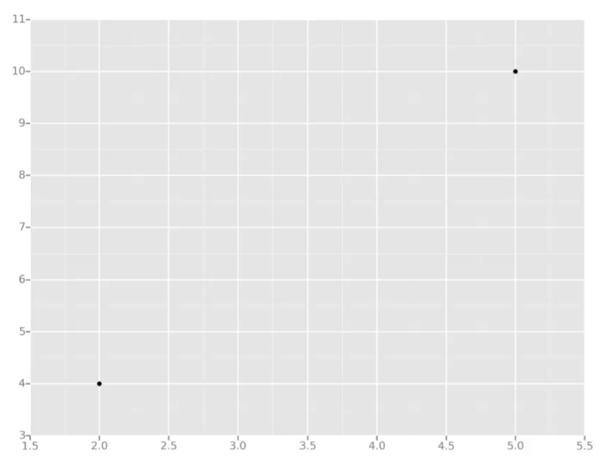
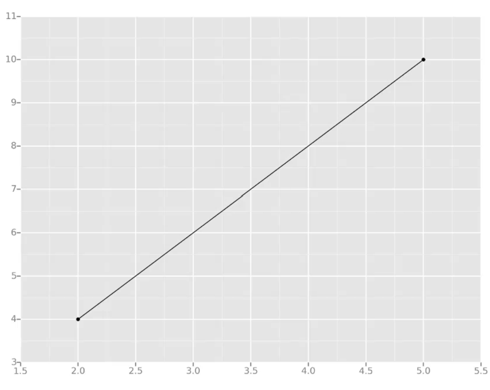
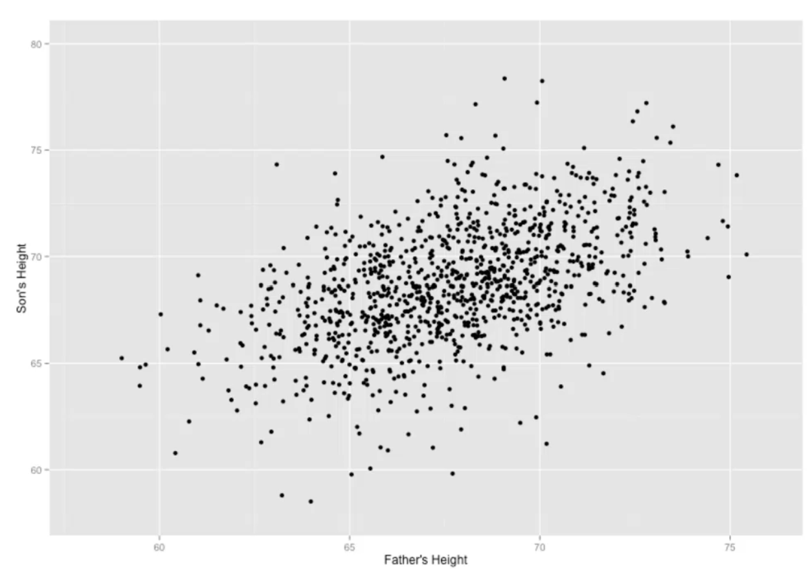
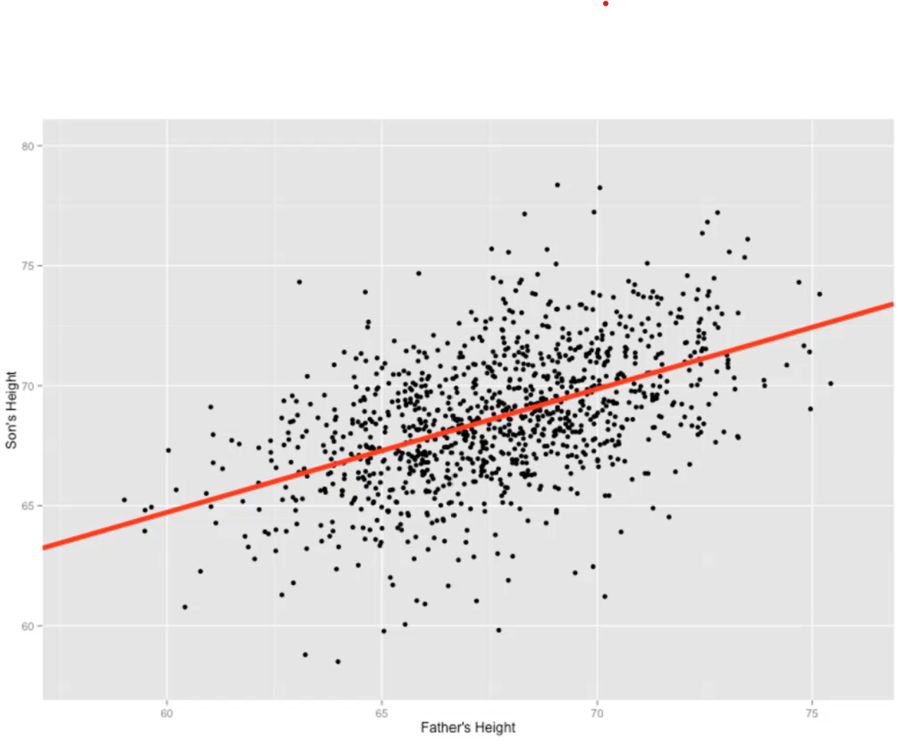
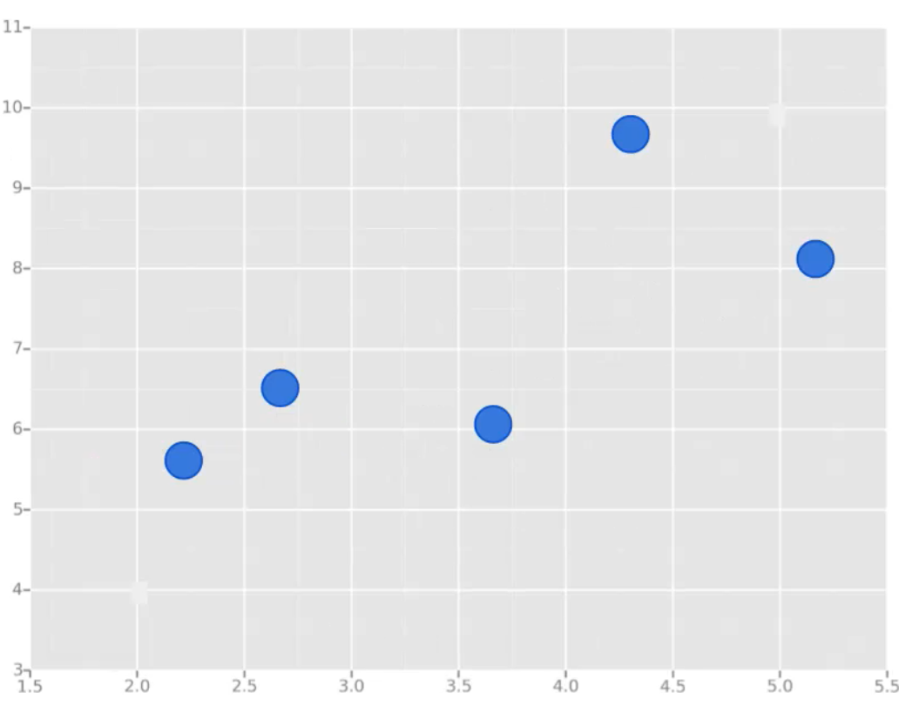
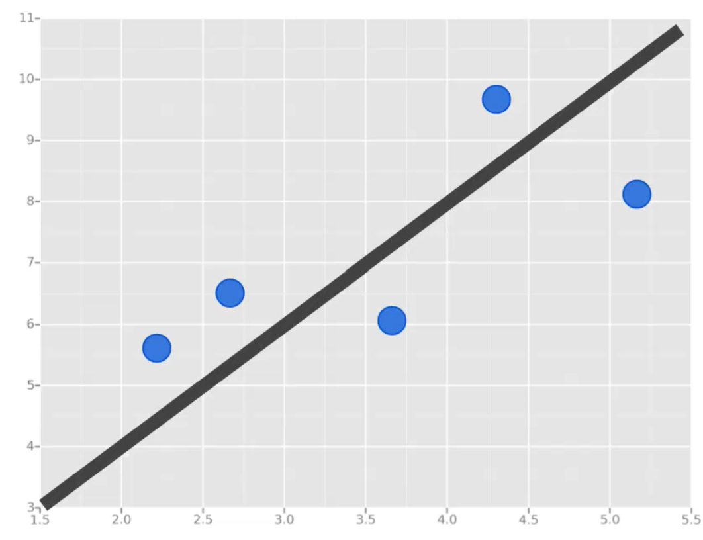
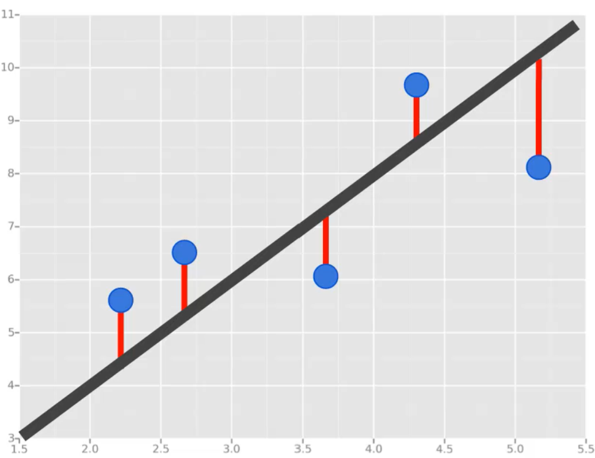

# Linear Regression

## History

This all started in the 1800s with a guy named Francis Galton. Galton was studying the relationship between parents and their children. In particular, he investiagted the relationship between the heights of fathers and their sons.

What he discovered was that a man's son tended to be roughly as tall as his father.

However Galton's breakthrough was that the son's height **tended to be closer to the overall average** height of all people.

### Example

Let's take Shaqeuille O'Neal asan example. Shaq is really tall 2.2 meters.

If Shaq has a son, chances are he'll be pretty tall too. However, Shaq is such an anomaly that there is also a very good chance that his on will be **not as tall as Shaq**.

Turns out this is the case: Shaq's son is pretty tall 2 meters, but not nearly as tall as his dad.

Galton called this phenomenon **regression**, as in "A father's son's height tends to regress (or drift towards) the mean (avergae) height."

Let's take the simplest possible example, calculating a regression with only 2 data points.

All we're trying to do when we calculate our regression line is draw a line that's as close to every dot as possible.

For classic linear regression, or "Least Squares Method", you only measure the closeness in the "up and down" direction.

Now wouldn't it be great if we could apply this same concept to a graph with more thant just two data points?

By doing this, we could take multiple men and their son's heights and do things like tell a man how tall we expect his son to be...before he even has a son!

Our goal with linear regression is to **minimize the vertical distance** between all the data points and our line.

So in determining the **best line**, we are attempting to minimize the distance between **all** the points and their distance to our line.

There are lots of different ways to minimize this, (sum of squared erros, sum of absolute erros, etc.), but all these methods have a general goal of minimizing this distance.

For example, one of the most popular methods is the least squares method. Here we have blue data points along an x and y axis.

Now we want to fit a linear regression line. The question is, how do we decide which line is the best fitting one?

We'll use the Least Squares Method, which is fitted by minimizing **sum of squares of the residuals**.

The residuals for an observation is the difference between the observation (the y-value) and the fitted line.

