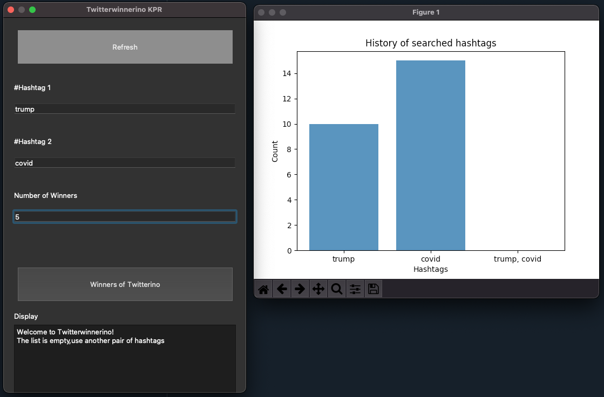

# Twitterino

This is a small application which was created as part of a module in my studies as a proof of achievement.

## Tools used

- Twitter-API
- PyQt5 GUI

## Functionality:

It is assumed that a certain number of winners are sought for a contest. You can win by using two specific Twitter hashtags.

The app searches Twitter for posts with these hashtags. From the users who have used both hashtags, a certain number are randomly selected.

